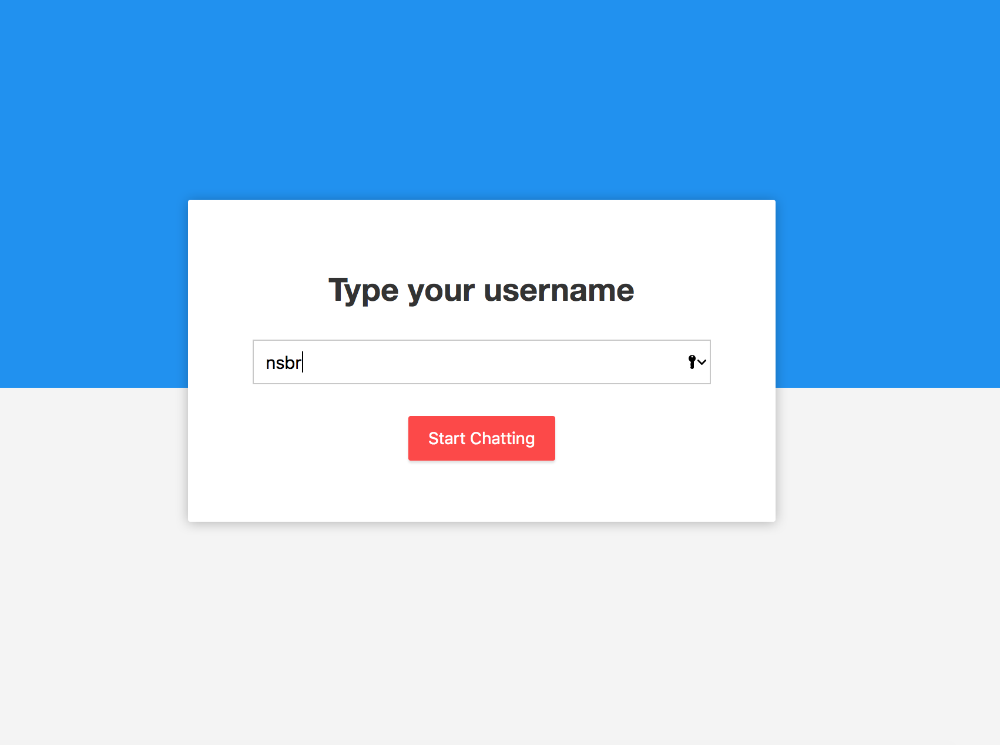
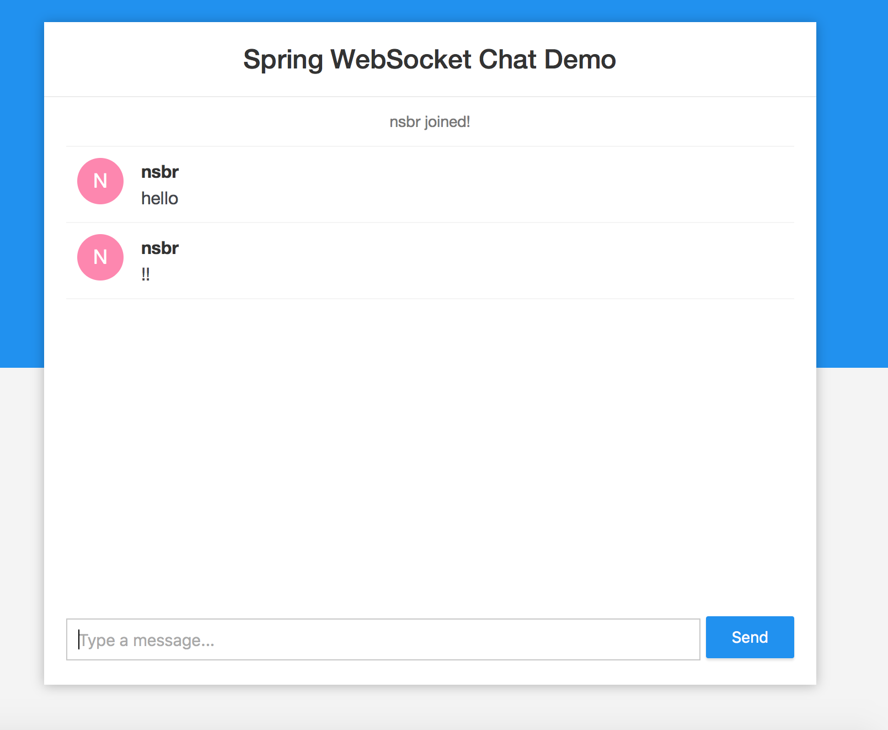

# Chat Application

<ul>
	<li><a href="#results">Final Results</a></li>
	<li><a href="#explain">Code Explanations and Notes</a></li>
	<li><a href="#howToRun">How to run?</a></li>
</ul>

<h3 id='explain'>Code Explanations and Notes</h3>

<h3 id='results'>Final Results</h3>
 
 

<h3 id='howToRun'>How to run?</h3>
<code>
	mvn spring-boot:run
</code>

